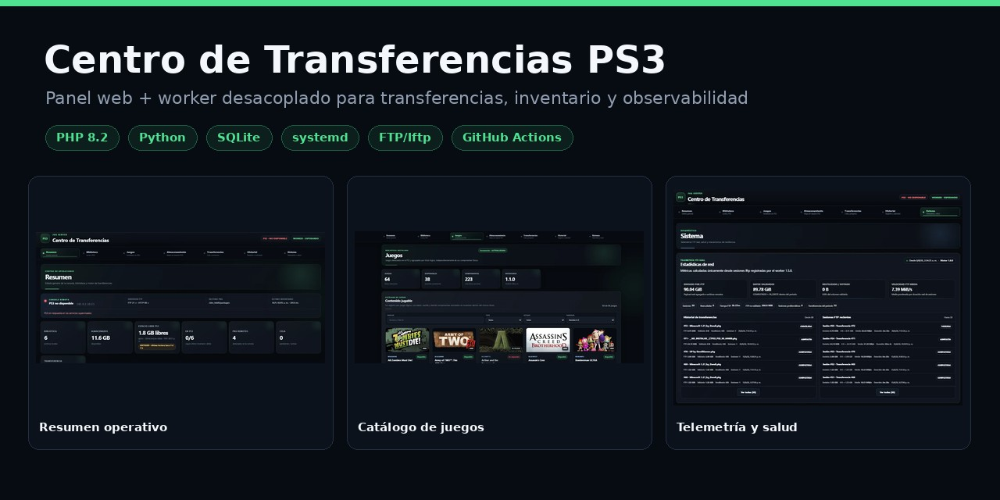
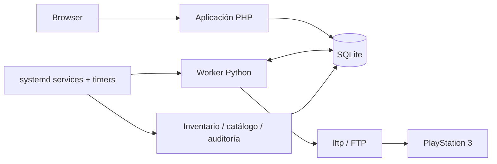

# Centro de Transferencias PS3 (CTPS3)

  

CTPS3 es una aplicación web para **administrar, observar y automatizar transferencias entre un servidor doméstico y una PlayStation 3**. La interfaz PHP/JavaScript está desacoplada de la ejecución operativa mediante SQLite y un worker Python, con inventario, almacenamiento, telemetría, auditoría y automatización por systemd.

> Este repositorio contiene una publicación sanitizada del proyecto: no incluye credenciales, IP privadas reales, bases productivas, logs, juegos, PKG, ISO ni otros datos del entorno original.

## Capacidades principales

| Área | Funcionalidad |
| --- | --- |
| Transferencias | Cola persistente, progreso, pausa/reanudación y ejecución desacoplada |
| Biblioteca | Descubrimiento local, comparación con la consola y envío de faltantes |
| Juegos | Catálogo lógico de títulos y componentes detectados en la PS3 |
| Almacenamiento | Inventario, clasificación, tamaño por categoría y revisión controlada |
| Telemetría | Métricas FTP, sesiones, velocidad, volumen transferido y actividad reciente |
| Resiliencia | Heartbeat del worker, recuperación de sesiones y comprobaciones automáticas |
| Auditoría | Historial operativo, estado certificado y trazabilidad de verificaciones |

## Capturas

### Resumen operativo

  

<table>
<tr>
<td width="50%" valign="top">
<strong>Catálogo de juegos</strong>  

</td>
<td width="50%" valign="top">
<strong>Gestión de almacenamiento</strong>  

</td>
</tr>
<tr>
<td width="50%" valign="top">
<strong>Motor de transferencias</strong>  

</td>
<td width="50%" valign="top">
<strong>Historial</strong>  

</td>
</tr>
<tr>
<td width="50%" valign="top">
<strong>Telemetría y sistema</strong>  

</td>
<td width="50%" valign="top">
<strong>Resiliencia operativa</strong>  

</td>
</tr>
</table>

La galería completa, incluyendo el historial de auditorías, está en [`docs/SCREENSHOTS.md`](docs/SCREENSHOTS.md).

## Arquitectura

La aplicación web registra y consulta estado; las operaciones largas son procesadas por el worker fuera del ciclo HTTP. Esta separación permite mantener cola persistente, recuperación ante interrupciones y observabilidad del flujo completo.

Documentación técnica ampliada: [`docs/ARCHITECTURE.md`](docs/ARCHITECTURE.md).

## Componentes

- **`app/`** — interfaz web, APIs, vistas, JavaScript y CSS.
- **`worker/`** — ejecución de transferencias y control operacional.
- **`tools/`** — inventario, catalogación, inspección, almacenamiento y auditoría.
- **`database/`** — schema SQLite sin datos productivos.
- **`config/`** — configuración de ejemplo sanitizada.
- **`systemd/`** — units genéricas para worker, catálogo e inventario.
- **`.github/`** — CI, Dependabot, CODEOWNERS y plantillas de colaboración.

## Estructura del flujo

1. El usuario opera desde la interfaz web.
2. La aplicación consulta o registra estado en SQLite.
3. El worker recoge las operaciones pendientes.
4. Se aplican validaciones y controles de ejecución.
5. `lftp` realiza la transferencia por FTP.
6. El resultado y la telemetría vuelven a persistirse.
7. La interfaz refleja el estado actualizado.

## Calidad y seguridad

GitHub Actions valida automáticamente en cada cambio dirigido a `main`:

- PHP 8.2;
- sintaxis Python;
- JavaScript con Node.js;
- shell scripts;
- JSON;
- recreación completa del schema SQLite.

La publicación excluye deliberadamente secretos, rutas internas reales, IP privadas, bases SQLite productivas, logs, backups, snapshots y contenido de juegos. Consulte [`SECURITY.md`](SECURITY.md) y [`CONTRIBUTING.md`](CONTRIBUTING.md).

## Configuración

`config/config.example.ini` contiene únicamente valores de ejemplo. La dirección `192.0.2.10` utilizada en material público pertenece al rango reservado para documentación y no identifica un equipo real.

Las units de `systemd/` y las rutas `/opt/ctps3`, `/var/lib/ctps3`, `/var/log/ctps3` y `/srv/ps3` son referencias genéricas y deben adaptarse al entorno de destino.

## Estado del proyecto

- **Estado:** funcional y derivado de un despliegue real de homelab.
- **Arquitectura:** web + persistencia + worker desacoplado.
- **CI:** activa mediante GitHub Actions.
- **Publicación:** sanitizada para portfolio y revisión técnica.

## Autor

Desarrollado y mantenido por **ProgDeveloperr**.
