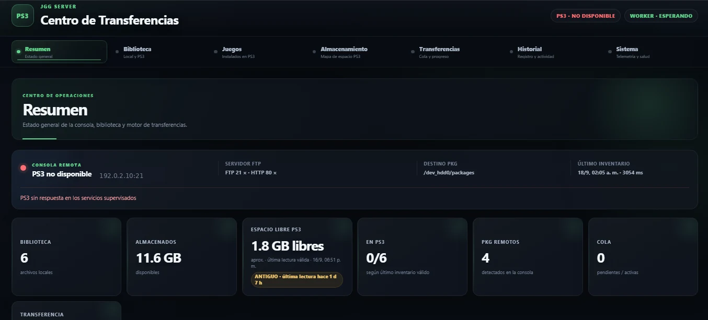
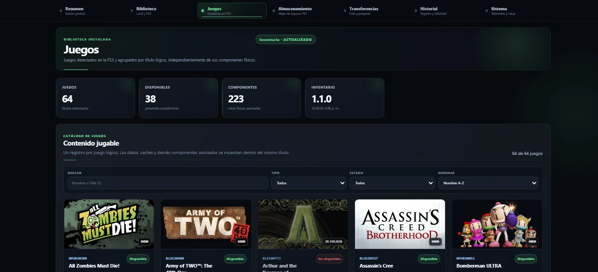
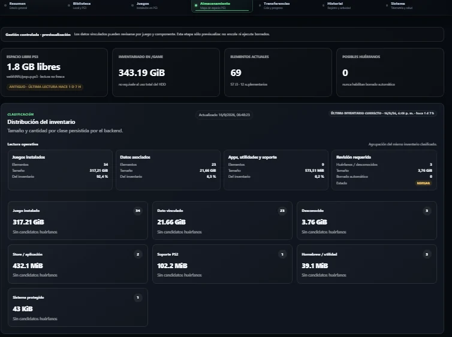
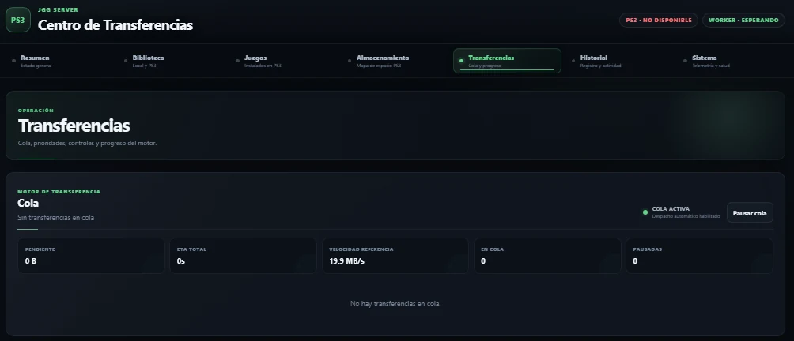
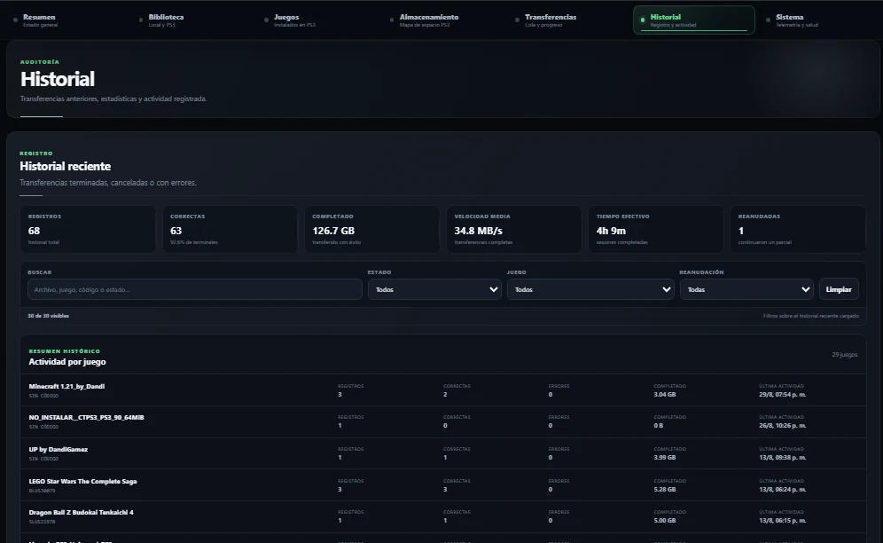
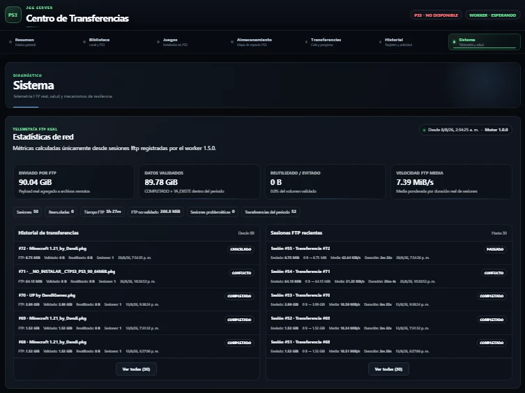
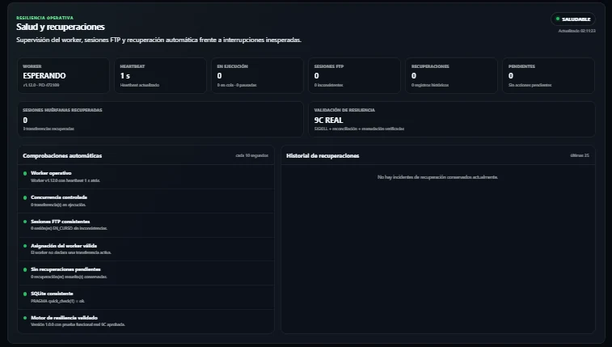
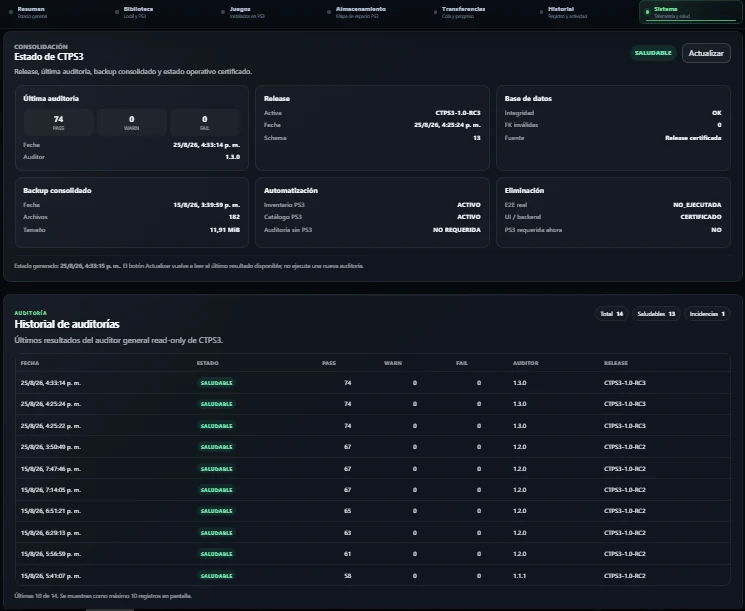

# Capturas de CTPS3

Esta galería muestra los principales módulos de la interfaz. Las capturas utilizadas para publicación fueron seleccionadas y sanitizadas para no exponer endpoints privados reales.

## Resumen operativo

## Catálogo de juegos

## Gestión de almacenamiento

## Transferencias

## Historial

## Telemetría y sistema

## Resiliencia operativa

## Auditorías

